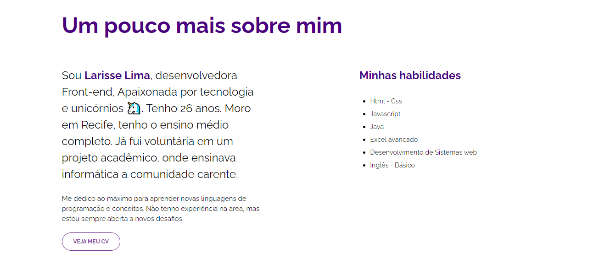

<h1 align="center" >
   Workshop {REPROGRAMA}
</h1>

<h3 align="center">
    Landing Page
</h3>

## 💻 Sobre o projeto

 Landing Page desenvolvida no workshop  Front-end da {REPROGRAMA}

 ---
## 🛠 Tecnologias
O projeto foi desenvolvido utilizando as seguintes tecnologias:

- HTML
- CSS

---

## 🎨 Layout

---

<b>Feito com 	:coffee:   por Larisse Lima</b>

